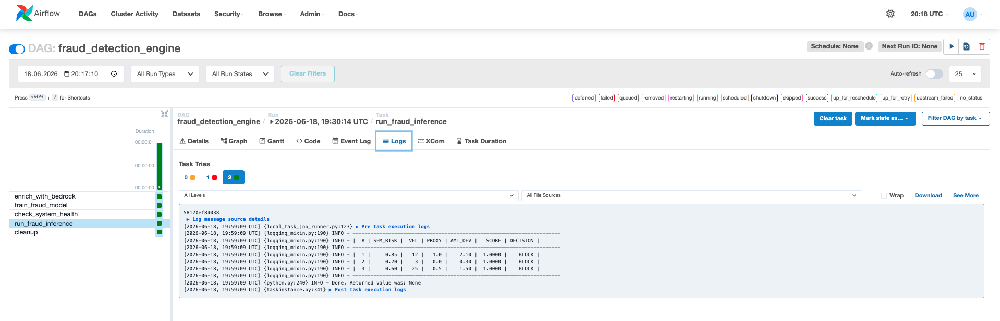
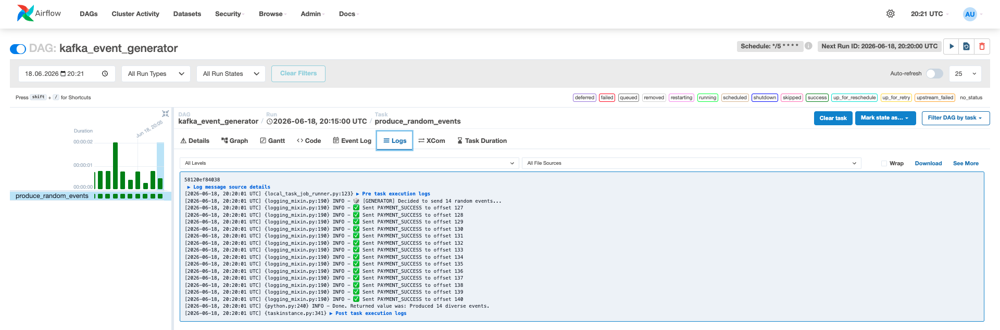
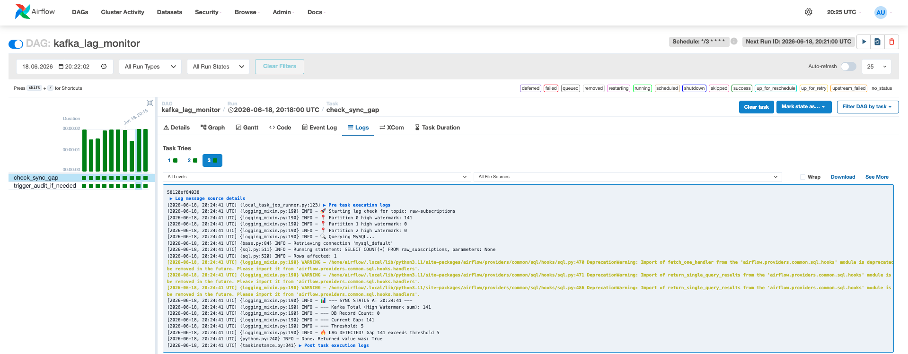
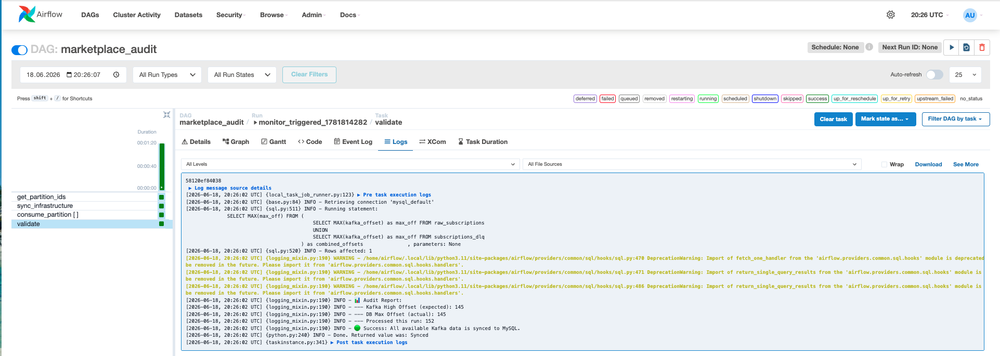
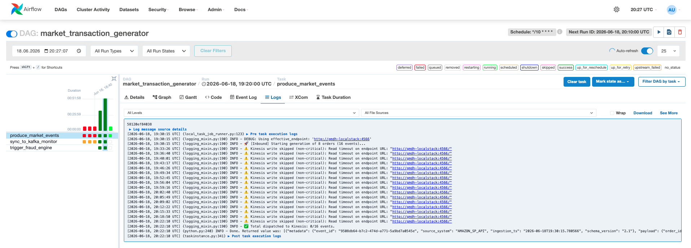
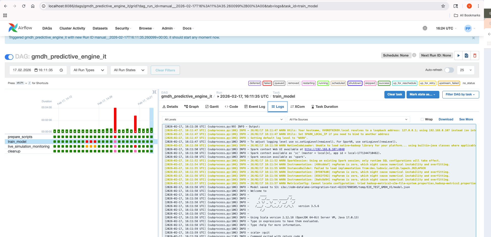
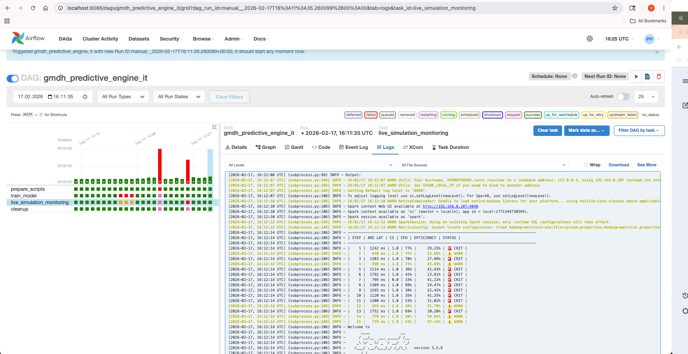
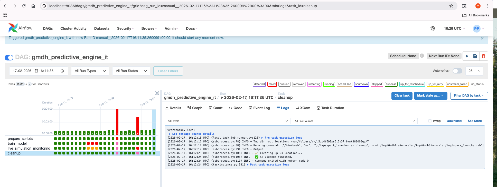

# GMDH Predictive Engine — Adaptive Fraud & Infrastructure Intelligence

A **self-learning monitoring and predictive system** for cloud architecture efficiency. The project demonstrates an end-to-end MLOps pipeline — from synthetic data generation and model training to real-time simulation and automated resource cleanup — orchestrated entirely by Apache Airflow.

> **Core idea:** A self-learning platform where GMDH polynomial acts as a mathematical leash on LLM (Bedrock / Ollama) — the model automatically reduces trust in unreliable AI signals through coefficient evolution, while gating all business decisions on verified system health.

---

##  Why This Project Exists

This is a portfolio project that showcases:

- **MLOps lifecycle** — data generation → training → model persistence → inference → cleanup
- **Transparent ML** — GMDH produces an interpretable polynomial, not a black-box prediction
- **Data pipeline engineering** — Kafka ingestion, MySQL sync, DLQ handling, recursive reconciliation
- **Infrastructure as Code** — fully Dockerized + Helm charts for Kubernetes deployment
- **Production patterns** — idempotency, dead letter queues, self-healing DAGs, parallel processing
- **Pluggable architecture** — scoring engine factory with A/B comparison (GMDH vs Ollama vs mock)
- **Local LLM integration** — Ollama for real semantic analysis without cloud dependencies
- **Observability** — New Relic APM decorators for Airflow task tracing
- **Connected architecture** — all DAGs are linked into a single feedback-driven ecosystem

---

##  Architecture Overview

```
┌─────────────────────────────────────────────────────────────────────┐
│                       ORCHESTRATION (Airflow)                       │
├─────────────────────────────────────────────────────────────────────┤
│                                                                     │
│  kafka_event_generator (*/5 min)                                    │
│       │ writes subscription events to Kafka                         │
│       ▼                                                             │
│  kafka_lag_monitor (*/3 min)                                        │
│       │ compares Kafka watermark vs MySQL count                     │
│       │ gap > threshold? → triggers ↓                               │
│       ▼                                                             │
│  marketplace_audit (recursive, self-healing)                        │
│       │ parallel consume (3 partitions) → MySQL                     │
│       │ bad JSON → DLQ (Kafka + MySQL)                              │
│       │ validates → gap still > 0? → triggers itself                │
│       │                                                             │
│  ─────┼──────────────────────────────────────────────────────────   │
│       │                                                             │
│  market_transaction_generator (*/10 min)                            │
│       │ generates SP-API + Cybersource events → Kinesis             │
│       │ notifies system-monitor topic                               │
│       ▼                                                             │
│  fraud_detection_engine (auto-triggered)                            │
│       │ Ollama / Bedrock (mock) → semantic feature extraction       │
│       │ Python GMDH → trains fraud model (Model A)                  │
│       │                   + health model (Model B)                  │
│       │ check_system_health() → queries MySQL sync state            │
│       │   └─ connects to data integrity layer                       │
│       │   └─ if system degraded → DISABLE inference (fallback)      │
│       ▼                                                             │
│  fraud inference: GMDH / Ollama / mock → BLOCK / ALLOW              │
│  compare_engines: A/B scoring across all 3 engines                  │
│                                                                     │
└─────────────────────────────────────────────────────────────────────┘
```

The system monitors **3 levels of health** that feed into each other:

1. **Data integrity** — guarantees zero data loss between Kafka and MySQL
2. **Infrastructure efficiency** — ML model predicts system health from latency, auth status, and CPU load
3. **Business logic (Fraud)** — ML model scores transactions, but only when infrastructure is healthy

---

##  How DAGs Connect

| Source DAG | Trigger | Target DAG | Connection Type |
|-----------|---------|-----------|-----------------|
| `kafka_event_generator` | schedule (*/5 min) | — | Produces Kafka events |
| `kafka_lag_monitor` | detects gap > 5 | `marketplace_audit` | `trigger_dag()` |
| `marketplace_audit` | gap still > 0 | `marketplace_audit` | Recursive self-trigger |
| `market_transaction_generator` | after success | `fraud_detection_engine` | `TriggerDagRunOperator` |
| `fraud_detection_engine` | health check task | reads `raw_subscriptions` | MySQL query (cross-DAG data dependency) |

### Fraud Detection Engine (internal flow)

```
enrich_with_bedrock (configurable: bedrock_mock | ollama)
        |
    +---+---+
    |       |
    v       v
  train   train
  Model A Model B
  (fraud) (health)
    |       |
    +---+---+
        |
        v
check_system_health  <-- reads model_b_health.json (produced by Model B)
        |
    +---+---+
    |       |
    v       v
run_fraud     compare_engines   <-- A/B: runs all 3 engines on same data
_inference        (gmdh vs bedrock_mock vs ollama)
    |       |
    +---+---+
        |
        v
    cleanup
```

Model A and Model B train **in parallel**. Model B produces `health_score`.
If `health_score < 0.45` then Model A inference is **disabled** (fallback mode).

### Feedback Loop

```
Transactions generated --> Fraud model trained --> Health checked -->
    If system unhealthy --> Disable fraud scoring -->
        Wait for marketplace_audit to fix sync -->
            System recovers --> Re-enable fraud scoring
```

---

##  The GMDH Algorithm

**GMDH (Group Method of Data Handling)** is a self-organizing approach to building polynomial models, invented by Alexei Ivakhnenko (1968).

### Why GMDH instead of Neural Networks / XGBoost?

| Criterion | GMDH | Black-box ML |
|-----------|------|--------------|
| Interpretability | Final formula is a readable polynomial | Opaque |
| Auditability | Can explain *why* an alert fired | Cannot |
| Model size | ~500 bytes JSON | MB–GB |
| Inference speed | Single formula, microseconds | Requires ML runtime |
| Self-organization | Automatically selects important interactions | Manual feature engineering |

### How It Works (2-Layer Architecture)

```
Inputs: x1 (API latency), x2 (auth status), x3 (CPU load)
                    │
         ┌─────────┼─────────┐
         ▼         ▼         ▼
   ┌──────────┐ ┌──────────┐ ┌──────────┐
   │node_x1_x2│ │node_x1_x3│ │node_x2_x3│   ← Layer 1: all C(n,2) pairs
   └────┬─────┘ └────┬─────┘ └────┬─────┘
        │             │             │
        └── RMSE selection (top 2) ─┘         ← External criterion
                    │
              ┌─────┴─────┐
              ▼           ▼
           z1 (best)   z2 (2nd best)
              │           │
              ▼           ▼
        ┌─────────────────────┐
        │    Master Node      │               ← Layer 2
        │ f(z1, z2, z1·z2)   │
        └─────────┬───────────┘
                  ▼
           output score (0–1)
```

Each neuron computes: `ŷ = β₀ + β₁·xᵢ + β₂·xⱼ + β₃·(xᵢ·xⱼ)`

The final deployed model is a **4th-order polynomial** with fully interpretable coefficients.

---

##  Dual-Model Architecture (Fraud + Health)

The system runs **two GMDH models** trained with the same algorithm on different domains:

```
┌─────────────────────────────────────────────────────────┐
│                 GMDH ENGINE (same algorithm)            │
├──────────────────────────┬──────────────────────────────┤
│   MODEL A: Fraud         │   MODEL B: System Health     │
│                          │                              │
│   Inputs:                │   Inputs:                    │
│   • semantic_risk        │   • cpu_load                 │
│     (from Bedrock LLM)   │   • api_latency              │
│   • velocity_1h          │   • auth_status              │
│   • proxy_score          │                              │
│   • amount_deviation     │                              │
│                          │                              │
│   Output: fraud_prob     │   Output: health_score       │
│   Action: Block/Allow    │   Action: Scale/Alert        │
├──────────────────────────┴──────────────────────────────┤
│                    FALLBACK LOGIC                       │
│   If Model B health < 0.45 → disable Model A inference  │
│   (degraded system = unreliable fraud predictions)      │
└─────────────────────────────────────────────────────────┘
```

### Why Two Models, Not One?

- **Isolation** — CPU spike ≠ fraud. Separate models prevent false positives
- **Different cadence** — fraud = milliseconds, system health = minutes
- **Auditability** — regulators want separate audit trail for fraud decisions
- **Independent retraining** — if Bedrock/Ollama drifts, only Model A retrains

### LLM Integration (Bedrock + Ollama)

The system supports **pluggable LLM engines** for feature extraction and scoring:

| Engine | Mode | Use Case |
|--------|------|----------|
| `bedrock_mock` | Deterministic hash | Fast local testing, no LLM dependency |
| `ollama` | Live LLM inference | Real semantic analysis via local model |
| `gmdh` | Polynomial scoring only | Pure math, microsecond inference |

**Ollama** acts as a local alternative to Amazon Bedrock:
1. Receives raw transaction text
2. Returns `semantic_risk` score (0–1) via prompt-based scoring
3. Supports model switching via `OLLAMA_MODEL` env var (`tinyllama`, `phi3:mini`, `mistral`)

**Amazon Bedrock** (mock) provides a deterministic baseline:
1. Receives raw transaction text
2. Returns hash-based `semantic_risk` score (0–1)
3. Useful for reproducible testing

In both cases, GMDH uses the LLM output as one input alongside numeric metrics. If scores prove unreliable (detected via reconciliation), GMDH reduces the coefficient weight automatically on retrain.

### Output Thresholds

**Model A (Fraud):**

| Score | Decision | Action |
|-------|----------|--------|
| > 0.55 |  BLOCK | Transaction rejected |
| ≤ 0.55 |  ALLOW | Transaction proceeds |

**Model B (Health):**

| Efficiency | Status | Action |
|-----------|--------|--------|
| > 75% |  OK | No action |
| 45–75% |  WARN | Investigate |
| < 45% |  CRITICAL | Disable Model A, fallback mode |

---

##  A/B Engine Comparison

The `fraud_detection_engine` DAG includes a `compare_engines` task that runs **all 3 scoring engines** on the same input data and prints a side-by-side comparison.

### How It Works

```
Same 3 transactions
        │
   ┌────┼────┐
   ▼    ▼    ▼
 GMDH  Mock  Ollama
   │    │    │
   └────┼────┘
        ▼
  Comparison table
  (scores + decisions + agreement)
```

### Expected Output (in `compare_engines` task logs)

```
================================================================================
ENGINE COMPARISON (same inputs)
================================================================================
|  # |         GMDH |  BEDROCK_MOCK |       OLLAMA | AGREE |
--------------------------------------------------------------------------------
|  1 |  0.823 BLOCK |   0.670 BLOCK |  0.750 BLOCK |   YES |
|  2 |  0.120 ALLOW |   0.340 ALLOW |  0.300 ALLOW |   YES |
|  3 |  0.589 BLOCK |   0.450 ALLOW |  0.610 BLOCK |    NO |
================================================================================
```

### What Each Engine Does

| Engine | How it scores | Deterministic? | Speed |
|--------|--------------|----------------|-------|
| `gmdh` | Applies trained polynomial (JSON coefficients) | Yes | ~1μs per tx |
| `bedrock_mock` | MD5 hash of features → score | Yes | ~1μs per tx |
| `ollama` | Sends prompt to LLM, parses numeric response | No | ~1-5s per tx |

### What "AGREE" Means

- **YES** — all engines made the same BLOCK/ALLOW decision. High confidence.
- **NO** — engines disagree. This highlights edge cases where:
  - GMDH polynomial is uncertain (score near 0.55 threshold)
  - Ollama's semantic understanding differs from mathematical model
  - Mock baseline diverges (useful for detecting model drift)

### Configuration

In `dags/fraud_detection_dag.py`:
```python
FEATURE_ENGINE = 'bedrock_mock'   # or 'ollama' — used for enrichment
SCORING_ENGINE = 'gmdh'           # or 'bedrock_mock' or 'ollama' — used for primary inference
```

The `compare_engines` task always runs all 3 regardless of these settings, providing a continuous A/B baseline.

---

##  Data Integrity Pipeline

The audit system guarantees **zero data loss** between Kafka and MySQL:

```
kafka_lag_monitor (every 3 min)
        │
        ├─ gap = 0 → sleep
        │
        └─ gap > 0 → trigger marketplace_audit
                            │
                            ├─ parallel consume (3 partitions)
                            ├─ INSERT IGNORE (deduplication)
                            ├─ bad JSON → DLQ (Kafka + MySQL)
                            │
                            └─ validate → gap still > 0?
                                    │           │
                                    yes         no
                                    │           │
                              trigger self    done 
                              (recursion)
```

Key patterns:
- **Idempotent replay** — always scans from offset 0, `UNIQUE` constraint prevents duplicates
- **Dual DLQ** — errors persist in both Kafka topic and MySQL table
- **Self-healing** — recursive trigger until convergence
- **Cross-DAG dependency** — `fraud_detection_engine` queries `raw_subscriptions` count to estimate system health

---

##  Technology Stack

| Layer | Technology | Purpose |
|-------|-----------|---------|
| Orchestration | Apache Airflow 2.10.5 (Python 3.11) | DAG scheduling, task dependencies, recursive triggers |
| Processing | Apache Spark (Scala) + Python | GMDH model training (Scala for Spark, Python for containerized) |
| Streaming | Apache Kafka (KRaft, Confluent 7.6.0) | Event ingestion, DLQ, system-monitor topic |
| Storage | AWS S3 (via S3A) + MySQL 8.0 | Model artifacts, operational data |
| Cloud Emulation | LocalStack 2.3.2 | Kinesis & S3 for local development |
| LLM Integration | Ollama (tinyllama/phi3/mistral) + Amazon Bedrock (mock) | Semantic feature extraction, direct fraud scoring |
| Scoring Engines | Pluggable factory: GMDH, Bedrock Mock, Ollama | A/B comparison of scoring strategies |
| Containerization | Docker Compose + Helm (Kubernetes) | Local dev (one command) + K8s-ready deployment |
| Monitoring | New Relic APM (optional) | Background task tracing via decorators |
| Code Quality | Pylint + AWS Athena | Historical score tracking |

---

##  Project Structure

```
gmdh-predictive-engine/
├── dags/
│   ├── fraud_detection_dag.py        # Dual-model DAG: enrich → train → fallback → inference + A/B engine comparison
│   ├── kafka_event_generator.py      # Produces random subscription events to Kafka
│   ├── kafka_queue_monitor.py        # Lag detection → triggers audit if gap found
│   ├── market_transaction_generator.py # SP-API + Cybersource → Kinesis → triggers fraud engine
│   └── marketplace_audit.py          # Recursive Kafka→MySQL sync with DLQ
├── dags_backup/
│   └── gmdh_predictive_engine_it.py  # Core ML DAG: Model B (train → simulate → cleanup)
├── jobs/
│   ├── scoring_engine.py             # Unified engine factory (bedrock_mock / gmdh / ollama)
│   ├── engines/
│   │   ├── base.py                   # ScoringEngine abstract interface
│   │   ├── bedrock_engine.py         # Deterministic hash-based mock (Bedrock)
│   │   ├── gmdh_engine.py            # Polynomial scoring from JSON coefficients
│   │   └── ollama_engine.py          # Live LLM scoring via Ollama API
│   ├── bedrock_extractor.py          # Legacy Bedrock feature extractor (kept for reference)
│   ├── gmdh_fraud_trainer.py         # Python GMDH trainer for Model A (fraud, 2-layer)
│   ├── gmdh_fraud_trainer.scala      # Scala reference implementation (Model A)
│   ├── gmdh_health_trainer.py        # Python GMDH trainer for Model B (system health)
│   ├── airflow_pylint_qa/            # Pylint analysis + New Relic APM decorators
│   └── marketplace_audit/            # Integration tests
├── helm/
│   └── gmdh-engine/                  # Kubernetes Helm chart
│       ├── Chart.yaml
│       ├── values.yaml               # Configurable: scoring engine, Ollama model, resources
│       └── templates/                # Deployments: Airflow, Kafka, MySQL, Ollama
├── scripts/
│   ├── generate_it_dataset.py        # Synthetic infra dataset (10K records)
│   ├── generate_fraud_dataset.py     # Synthetic fraud dataset (5K records)
│   └── generate_production_dataset.py # Production-like fraud dataset (50K, with drift)
├── tests/
│   └── test_model_quality.py         # E2E model quality tests (14 assertions)
├── data/
│   ├── fintech_transactions_raw.csv  # Model B training data
│   ├── fraud_transactions.csv        # Model A training data (5K)
│   ├── fraud_production_50k.csv      # Production-like dataset with drift (50K)
│   ├── fraud_model_coeffs.json       # Model A coefficients (produced by trainer)
│   ├── model_b_coeffs.json           # Model B coefficients
│   ├── model_b_health.json           # Model B health score (used by fallback logic)
│   └── enriched_transaction.json     # Sample Bedrock-enriched events
├── kafka/
│   └── docker-compose.yaml           # Kafka standalone config (reference)
├── docker-compose.yaml               # ALL services: MySQL + Kafka + LocalStack + Ollama + Airflow
├── Dockerfile                        # Custom Airflow image (Python 3.11 + Kafka client)
├── .env                              # Environment variables (OLLAMA_MODEL, MySQL creds)
└── .gitignore
```

---

##  Quick Start

### Prerequisites

- Docker Desktop or Rancher Desktop
- Python 3.11+ (for dataset generation only)

#### Rancher Desktop: Memory Configuration

The full stack (Airflow + Kafka + MySQL + Ollama + LocalStack) requires at least **8 GB RAM** allocated to the VM. Default 4 GB will cause Airflow webserver timeouts.

| Setting | Minimum | Recommended |
|---------|---------|-------------|
| Memory | 8 GB | 10–12 GB |
| CPUs | 4 | 4–6 |

**How to change:**
1. Open **Rancher Desktop** → **Preferences**
2. Go to **Virtual Machine**
3. Set **Memory** to 8+ GB, **CPUs** to 4+
4. Click **Apply** (VM will restart)
5. Make sure **Container Engine** is set to **dockerd (moby)**, not containerd

### 1. Start Everything

```bash
docker-compose up -d
```

This starts **all services** in one command:
- MySQL 8.0 (Airflow metadata + operational data)
- Kafka (KRaft mode, single-node)
- LocalStack (S3 + Kinesis emulation)
- Ollama LLM (tinyllama by default; configurable via `OLLAMA_MODEL` in `.env`)
- Airflow (webserver + scheduler)

Services start in dependency order: MySQL → Kafka → LocalStack → Ollama → Airflow.

> **First startup takes ~60–90 seconds.** Airflow webserver needs time to parse DAGs and initialize. If `http://localhost:8080` is not available immediately, wait and retry.

### 2. Kafka Topics (auto-created)

Topics are created automatically by the `kafka-init` service on startup. No manual steps needed.

If you need to verify:

```bash
docker exec gmdh-kafka kafka-topics --bootstrap-server localhost:9092 --list
```

### 3. Generate Training Data

```bash
pip install pandas numpy
python scripts/generate_it_dataset.py
python scripts/generate_fraud_dataset.py
```

### 4. Access Airflow

Open `http://localhost:8080`

Set admin password:
```bash
docker exec gmdh-airflow airflow users reset-password --username admin --password admin
```

### 5. Activate DAGs

```bash
docker exec gmdh-airflow airflow dags unpause kafka_event_generator
docker exec gmdh-airflow airflow dags unpause kafka_lag_monitor
docker exec gmdh-airflow airflow dags unpause marketplace_audit
docker exec gmdh-airflow airflow dags unpause market_transaction_generator
docker exec gmdh-airflow airflow dags unpause fraud_detection_engine
```

### 6. Watch It Work

Once activated, the system runs autonomously:
1. `kafka_event_generator` produces events every 5 min
2. `kafka_lag_monitor` detects gap every 3 min → triggers `marketplace_audit`
3. `marketplace_audit` syncs recursively until gap = 0
4. `market_transaction_generator` sends to Kinesis every 10 min → triggers `fraud_detection_engine`
5. `fraud_detection_engine` checks system health → runs fraud inference

### 7. Where to See Results

**Airflow UI:** `http://localhost:8080` (admin / admin)

| What to check | Where in UI |
|---------------|-------------|
| All DAG statuses | Home page — green/red circles per DAG |
| Fraud scoring decisions | `fraud_detection_engine` → click a run → task `run_fraud_inference` → **Logs** |
| Engine A/B comparison | `fraud_detection_engine` → task `compare_engines` → **Logs** |
| Model training output | `fraud_detection_engine` → task `train_fraud_model` → **Logs** |
| System health check | `fraud_detection_engine` → task `check_system_health` → **Logs** |
| Kafka events produced | `kafka_event_generator` → any run → **Logs** |
| Data sync verification | `marketplace_audit` → task `validate_sync` → **Logs** |
| Kinesis dispatch | `market_transaction_generator` → task `produce_market_events` → **Logs** |

**From terminal (without UI):**

```bash
# Check latest fraud detection results
docker exec gmdh-airflow airflow tasks logs fraud_detection_engine run_fraud_inference -1

# Check engine comparison
docker exec gmdh-airflow airflow tasks logs fraud_detection_engine compare_engines -1

# Check system health status
docker exec gmdh-airflow airflow tasks logs fraud_detection_engine check_system_health -1

# List recent DAG runs
docker exec gmdh-airflow airflow dags list-runs -d fraud_detection_engine
```

**Expected output in `run_fraud_inference` logs:**

```
----------------------------------------------------------------------
|  # | SEM_RISK |  VEL | PROXY | AMT_DEV |   SCORE | DECISION |
----------------------------------------------------------------------
|  1 |     0.85 |   12 |   1.0 |    2.10 |  0.8234 |    BLOCK |
|  2 |     0.20 |    3 |   0.0 |    0.30 |  0.1205 |    ALLOW |
|  3 |     0.60 |   25 |   0.5 |    1.50 |  0.5891 |    BLOCK |
----------------------------------------------------------------------
Engine: gmdh
```

---

##  Kubernetes Deployment (Helm)

The project includes a production-ready Helm chart at `helm/gmdh-engine/` for Kubernetes deployment.

### Install

```bash
helm install gmdh-engine helm/gmdh-engine/
```

### Configuration (values.yaml)

```yaml
# Scoring engine selection
scoring:
  featureEngine: bedrock_mock    # bedrock_mock | ollama
  scoringEngine: gmdh            # bedrock_mock | gmdh | ollama

# Ollama LLM model
ollama:
  enabled: true
  model: tinyllama               # tinyllama | phi3:mini | mistral
  resources:
    requests:
      memory: "4Gi"
      cpu: "2"

# Kafka topics (auto-created)
kafka:
  topics:
    - name: raw-subscriptions
      partitions: 3
    - name: subscriptions_dlq
      partitions: 1
    - name: system-monitor
      partitions: 1
```

### What Gets Deployed

| Resource | Template |
|----------|----------|
| Airflow (webserver + scheduler) | `airflow-deployment.yaml` |
| MySQL 8.0 (StatefulSet) | `mysql-deployment.yaml` |
| Kafka (KRaft, StatefulSet) | `kafka-statefulset.yaml` |
| Ollama LLM | `ollama-deployment.yaml` |
| Ollama model pull (Job) | `ollama-init-job.yaml` |
| ConfigMap (env vars) | `configmap.yaml` |

### Override Values

```bash
# Use larger LLM model
helm install gmdh-engine helm/gmdh-engine/ \
  --set ollama.model=mistral \
  --set ollama.resources.requests.memory=8Gi

# Disable Ollama (Bedrock-only mode)
helm install gmdh-engine helm/gmdh-engine/ \
  --set ollama.enabled=false \
  --set scoring.featureEngine=bedrock_mock
```

---

##  Clean Data Lake Principles

The pipeline ensures **zero-footprint execution**:

- Temporary Scala source files are deleted after runtime
- Model artifacts are removed from S3 after simulation
- Local temp directories are purged
- `trigger_rule='all_done'` ensures cleanup runs even on failure

---

##  Model Quality Validation

The project includes an end-to-end test suite that trains the GMDH model on a production-like dataset (50K records) and asserts minimum quality thresholds.

### Run Tests

```bash
# Generate production dataset (once)
python scripts/generate_production_dataset.py

# Run quality tests
pytest tests/test_model_quality.py -v
```

### Dataset Characteristics

| Property | Value |
|----------|-------|
| Total records | 50,000 |
| Fraud rate | 3% (realistic imbalance) |
| Fraud patterns | 4 (velocity spike, proxy ring, semantic cluster, combined) |
| Temporal drift | Last 20% of data contains adapted fraud (low velocity, no proxy) |
| Reproducibility | Fully deterministic (seed=2024), regenerate with one command |

### Dataset Origin & Methodology

The dataset is **synthetically generated** by `scripts/generate_production_dataset.py`. No real customer data is used.

**Why synthetic instead of a real dataset?**
- Full control over fraud patterns and temporal drift (impossible with static Kaggle data)
- No licensing or privacy concerns
- Reproducible with a single script, no downloads needed
- Features map exactly to our GMDH model inputs (semantic_risk, velocity_1h, proxy_score, amount_deviation)

**How distributions were chosen:**

Statistical properties are modeled after characteristics observed in real-world fraud research:

| Feature | Legitimate distribution | Fraud distribution | Inspired by |
|---------|----------------------|-------------------|-------------|
| `semantic_risk` | Beta(2, 8) — right-skewed, mostly low | Beta(6-8, 2-3) — high | NLP risk scores in payment fraud literature |
| `velocity_1h` | Lognormal(1.2, 0.6) — mean ~4/hr | Normal(25-35, 8) — high burst | IEEE-CIS `TransactionAmt` velocity patterns |
| `proxy_score` | 90% zero, 8% medium, 2% high | 5-40% zero, 25-30% medium, 30-70% high | Device/IP anonymity flags in IEEE-CIS |
| `amount_deviation` | Exponential(0.4) — mostly small | Normal(1.5-2.2, 0.5) — elevated | Standard deviation from user mean spend |
| `is_fraud` ratio | — | 3% overall | IEEE-CIS: 3.5%, real Visa/MC: 0.1-5% |

**Reference datasets (for comparison, not used directly):**

| Dataset | Records | Fraud % | Link |
|---------|---------|---------|------|
| IEEE-CIS Fraud Detection | 590K | 3.5% | [kaggle.com/c/ieee-fraud-detection](https://www.kaggle.com/c/ieee-fraud-detection) |
| Credit Card Fraud (ULB) | 284K | 0.17% | [kaggle.com/datasets/mlg-ulb/creditcardfraud](https://www.kaggle.com/datasets/mlg-ulb/creditcardfraud) |
| PaySim (synthetic mobile) | 6.3M | 0.13% | [kaggle.com/datasets/ealaxi/paysim1](https://www.kaggle.com/datasets/ealaxi/paysim1) |
| Sparkov Fraud (synthetic) | 1.3M | 0.58% | [kaggle.com/datasets/kartik2112/fraud-detection](https://www.kaggle.com/datasets/kartik2112/fraud-detection) |

These datasets can be used for benchmarking if you want to compare GMDH against the same data that XGBoost/LightGBM models are typically trained on.

### How to Interpret Test Results

```
tests/test_model_quality.py::TestModelQualityBaseline::test_auc_roc_minimum      PASSED
tests/test_model_quality.py::TestModelQualityBaseline::test_precision_minimum     PASSED
tests/test_model_quality.py::TestModelQualityBaseline::test_recall_minimum        PASSED
tests/test_model_quality.py::TestModelQualityBaseline::test_f1_minimum            PASSED
tests/test_model_quality.py::TestModelQualityBaseline::test_rmse_convergence      PASSED
tests/test_model_quality.py::TestDriftResilience::test_drift_auc_not_catastrophic PASSED
tests/test_model_quality.py::TestDriftResilience::test_drift_recall_degradation_bounded PASSED
tests/test_model_quality.py::TestPatternDetection::test_detects_velocity_spike    PASSED
tests/test_model_quality.py::TestPatternDetection::test_detects_proxy_ring        PASSED
tests/test_model_quality.py::TestPatternDetection::test_detects_semantic_cluster  PASSED
tests/test_model_quality.py::TestPatternDetection::test_detects_combined          PASSED
tests/test_model_quality.py::TestModelProperties::test_model_has_two_layer1_nodes PASSED
tests/test_model_quality.py::TestModelProperties::test_model_coefficients_bounded PASSED
tests/test_model_quality.py::TestModelProperties::test_model_size_small           PASSED

14 passed in 0.61s
```

**TestModelQualityBaseline** — Core production readiness. If any of these fail, the model should NOT be deployed:

| Test | Threshold | Interpretation |
|------|-----------|----------------|
| `test_auc_roc_minimum` | AUC >= 0.78 | Can the model tell fraud from legitimate at all? AUC = 0.5 means random guessing. Our polynomial must prove it learned real patterns, not noise. |
| `test_precision_minimum` | Precision >= 0.50 | Of every 10 transactions we block, are at least 5 actually fraud? Below this, we're annoying too many real customers. |
| `test_recall_minimum` | Recall >= 0.40 | Of every 10 actual frauds, do we catch at least 4? Below this, too much money leaks through. |
| `test_f1_minimum` | F1 >= 0.45 | Are precision and recall balanced? A model that blocks everything gets 100% recall but 3% precision — useless. F1 catches that trap. |
| `test_rmse_convergence` | RMSE < 0.35 | Did the training process converge? High RMSE means the polynomial couldn't fit the data — wrong features or too few layers. |

**TestDriftResilience** — How the model behaves when fraudsters change tactics:

| Test | Threshold | Interpretation |
|------|-----------|----------------|
| `test_drift_auc_not_catastrophic` | Drift AUC >= 0.62 | Last 20% of data simulates adapted fraudsters (low velocity, no proxy). Model should degrade gracefully, not collapse. AUC < 0.62 = "model is blind to new tactics". |
| `test_drift_recall_degradation_bounded` | Recall drop < 40pp | If stable recall = 60% and drift recall = 25%, that's a 35pp drop (OK). But a 50pp drop means the model is too brittle and needs retraining immediately. |

**TestPatternDetection** — Which fraud types the model can and cannot catch:

| Test | Threshold | Interpretation |
|------|-----------|----------------|
| `test_detects_combined` | >= 70% | When ALL signals fire (high semantic + high velocity + proxy + amount), model must catch most of them. If it can't detect the easiest case, something is fundamentally broken. |
| `test_detects_semantic_cluster` | >= 40% | Semantic risk is the strongest single feature (from LLM). Model should pick it up even alone. |
| `test_detects_velocity_spike` | >= 30% | Velocity alone is a weak signal for a 2-layer polynomial. 30% detection is acceptable — these cases rely on the next retrain cycle to improve. |
| `test_detects_proxy_ring` | >= 30% | Proxy + high amount. GMDH may deprioritize this pair if other pairs score better on RMSE. Acceptable weakness for 2-layer architecture. |

**TestModelProperties** — Structural sanity checks:

| Test | Threshold | Interpretation |
|------|-----------|----------------|
| `test_model_has_two_layer1_nodes` | == 2 | Verifies GMDH architecture is intact: exactly 2 winners selected from Layer 1. |
| `test_model_coefficients_bounded` | max |coeff| < 50 | Coefficients should not explode. Large values indicate multicollinearity or numerical instability — the model becomes unpredictable on unseen data. |
| `test_model_size_small` | < 2KB | The model is a JSON polynomial. If it exceeds 2KB, something went wrong. Small model = fast hot-reload, easy versioning, instant inference. |

### Why These Specific Thresholds?

- **AUC 0.78** — production fraud systems typically require 0.85+. We set 0.78 because GMDH is a 2-layer polynomial (not XGBoost). The gap demonstrates interpretability vs accuracy tradeoff.
- **Precision 0.50** — below this, customer support costs from false blocks exceed fraud losses.
- **Recall 0.40** — with 3% fraud rate, catching 40% still blocks significant dollar volume. Higher recall requires more layers or ensemble.
- **Drift AUC 0.62** — any model degrades on distribution shift. We allow degradation but not collapse (0.62 is still above random).
- **30% per-pattern** — single-signal fraud is genuinely hard for shallow models. The test documents this limitation honestly rather than hiding it.

### Quality Thresholds Summary

| Metric | Minimum | What it means |
|--------|---------|---------------|
| AUC-ROC | >= 0.78 | Model separates fraud from legitimate better than random |
| Precision | >= 0.50 | At least half of flagged transactions are actual fraud |
| Recall | >= 0.40 | Catches at least 40% of fraud |
| F1 | >= 0.45 | Balanced precision/recall acceptable |
| RMSE | < 0.35 | Model converged during training |

### Drift Resilience Tests

| Test | Threshold | Purpose |
|------|-----------|---------|
| Drift AUC-ROC | >= 0.62 | Model doesn't catastrophically fail on new patterns |
| Recall drop | < 40pp | Degradation bounded, not brittle |

### Per-Pattern Detection

| Pattern | Minimum detection | Notes |
|---------|------------------|-------|
| Combined (all signals) | >= 70% | Easiest, all features fire |
| Semantic cluster | >= 40% | Strong single-signal |
| Velocity spike | >= 30% | Weak in isolation for 2-layer GMDH |
| Proxy ring | >= 30% | Moderate signal, deprioritized by RMSE selection |

### Known Limitations

The 2-layer GMDH architecture selects only 2 winner nodes from 6 candidates (C(4,2) pairs). This means:
- Features not selected as winners contribute indirectly at best
- Single-signal fraud patterns (velocity-only, proxy-only) are harder to catch
- Adding adaptive layer depth (see Extensions) would improve per-pattern detection

---

##  Screenshots

### DAG: Fraud Detection Engine


### DAG: Kafka Event Generator


### DAG: Kafka Lag Monitor


### DAG: Marketplace Audit


### DAG: Market Transaction Generator


### Model Training Output


### Live Monitoring Simulation


### Automated Cleanup


---

##  Key Design Decisions

| Decision | Rationale |
|----------|-----------|
| Single docker-compose | One command to start everything; no external dependencies |
| Helm chart for K8s | Production-ready deployment with configurable values |
| Scala for Spark ML | Access to Spark MLlib with native performance; polyglot engineering |
| GMDH over deep learning | Interpretability required for infrastructure alerting |
| Pluggable scoring engines | A/B comparison of GMDH vs LLM vs mock; swap engines via env var |
| Ollama for local LLM | Real semantic analysis without cloud costs or API keys |
| Recursive DAG for audit | Guarantees eventual consistency without external schedulers |
| Dual-model with fallback | System health gates fraud decisions; prevents unreliable predictions |
| Bedrock as feature extractor | LLM enriches data but doesn't make decisions; GMDH stays in control |
| KRaft mode Kafka | Modern, ZooKeeper-free setup |
| Auto topic creation (kafka-init) | Zero manual steps on first startup |
| LocalStack for AWS | Full local development without cloud costs |
| New Relic decorators | Optional APM tracing for Airflow venv tasks |
| Cross-DAG triggers | Creates a connected ecosystem, not isolated scripts |

---

##  Production Architecture Reference

This project simulates a real-world **Adaptive Closed-Loop Fraud Detection** system. Here's how the production cycle works:

```
┌───────────────────────────────────────────────────────────────────┐
│                    24-HOUR EVOLUTION CYCLE                        │
├───────────────────────────────────────────────────────────────────┤
│                                                                   │
│  REAL-TIME (Fast Path, <100ms):                                   │
│    Transaction arrives                                            │
│      → Trust registered user (session, device fingerprint)        │
│      → Cybersource decision (ACCEPT/REJECT/REVIEW)                │
│      → If both OK → ALLOW instantly                               │
│      → Shadow-write event to archive (Kafka/Kinesis)              │
│                                                                   │
│  PARALLEL (Background, continuous):                               │
│    GMDH model trains on accumulating data                         │
│    Formula coefficients evolve as patterns shift                  │
│    New fraud vectors → new interaction terms gain weight          │
│                                                                   │
│  NIGHTLY (Reconciliation, batch):                                 │
│    Amazon SP-API sync                                             │
│      → Compare "what we allowed" vs "actual chargebacks/refunds"  │
│      → Identify false negatives (fraud we missed)                 │
│      → Small dataset (~0.1% of traffic)                           │
│                                                                   │
│  TARGETED ENRICHMENT (cost-efficient):                            │
│    Send ONLY bad cases to Bedrock                                 │
│      → LLM explains WHY it was fraud (semantic analysis)          │
│      → Extracts semantic_risk feature for retraining              │
│      → 99.9% of traffic never touches Bedrock (cost savings)      │
│                                                                   │
│  MODEL EVOLUTION:                                                 │
│    Retrain GMDH with enriched data                                │
│      → Coefficients shift (old patterns lose weight)              │
│      → New interaction terms emerge                               │
│      → Hot-reload model to production (JSON on S3)                │
│                                                                   │
│  REPEAT → system gets smarter every night                         │
│                                                                   │
└───────────────────────────────────────────────────────────────────┘
```

### How GMDH "Feels" Fraud Pattern Changes

GMDH doesn't detect drift through heuristics — it detects it **mathematically**:

1. **Coefficient Drift** — When fraudsters change tactics (e.g., from high-velocity to proxy-based), the nightly retrain shifts `β` weights automatically. Old indicators lose influence, new ones gain it.

2. **Node Selection** — GMDH builds all C(n,2) pairwise nodes and selects winners by RMSE. If a fraud pattern dies, its node shows higher error on validation data and gets replaced.

3. **Bedrock as Leash** — GMDH controls how much to trust the LLM. If Bedrock's `semantic_risk` scores prove unreliable (detected via reconciliation), the `β_semantic` coefficient shrinks on retrain. The polynomial mathematically "leashes" the LLM.

### What This Project Demonstrates

| Production Component | Project Implementation |
|---------------------|------------------------|
| Real-time scoring | `fraud_detection_engine` → inference task (GMDH / Ollama / mock) |
| Cybersource integration | `market_transaction_generator` → paired events |
| SP-API reconciliation | `kafka_lag_monitor` + `marketplace_audit` |
| Bedrock enrichment | `engines/bedrock_engine.py` (mock) + `engines/ollama_engine.py` (live) |
| GMDH evolution | `gmdh_fraud_trainer.py` → nightly retrain |
| Model hot-reload | JSON coefficients on filesystem/S3 |
| System health gating | `check_system_health` → fallback logic |
| Engine A/B testing | `compare_engines` task → side-by-side scoring |
| Kubernetes deployment | `helm/gmdh-engine/` → full Helm chart |
| APM observability | `nr_decorators.py` → New Relic background tasks |

---

##  Possible Extensions

- [ ] Add adaptive layer depth (grow GMDH until RMSE plateaus)
- [ ] Replace inline Scala with SBT project + `spark-submit`
- [ ] Add Prometheus/Grafana for real-time metric visualization
- [ ] Integrate AWS SSM Parameter Store for secrets
- [ ] Add model versioning (champion-challenger pattern)
- [ ] Schema Registry for Kafka event validation
- [ ] Real Bedrock API integration (replace mock with live AWS credentials)
- [ ] Flink streaming inference (replace batch simulation)
- [ ] Add alerting (SNS/Slack) when Model B health drops below threshold
- [ ] Larger Ollama models (Mistral 7B, Llama 3) for improved semantic accuracy

---

##  License As IS
