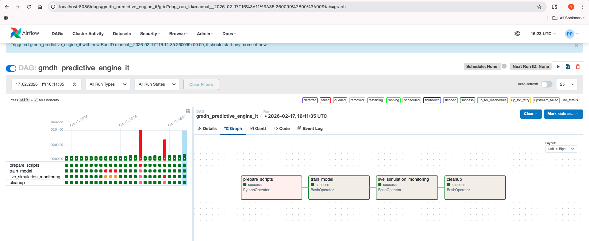

# GMDH Architecture Efficiency Engine 🚀

A self-learning monitoring and predictive system for cloud architecture efficiency. This project utilizes the **Group Method of Data Handling (GMDH)** to identify complex dependencies between infrastructure metrics and predict system health.

## 🛠 Technology Stack
* **Orchestration:** Apache Airflow (Python)
* **Processing Engine:** Apache Spark (Scala)
* **Data Lake:** AWS S3 (via Hadoop S3A connector)
* **ML Algorithm:** GMDH (Multi-layer Linear Regression with feature interaction)
* **Configuration:** JSON-based Secret Injection & AWS Profile Management

## 📂 Project Structure
* `dags/gmdh_predictive_engine_it.py` — Core Airflow DAG managing the model lifecycle.
* `scripts/generate_it_dataset.py` — Python utility to generate synthetic transaction data.
* `GmdhTrain.scala` — Spark script for iterative model training (Layer 1 & Layer 2).
* `GmdhSim.scala` — Predictive simulation engine for real-time monitoring.
* `gmdh_secrets.json` — Environment-specific configuration (Excluded from Git).

## 🧠 The GMDH Algorithm
Unlike standard black-box models, this engine builds a transparent polynomial model:
1. **Layer 1:** Evaluates combinations of inputs ($x_1, x_2, x_3$) and their interactions ($x_i \cdot x_j$).
2. **Selection:** Prunes weak nodes based on the **Root Mean Squared Error (RMSE)**.
3. **Master Node:** The final layer synthesizes the strongest neurons into a single efficiency predictor.

## 🚀 Setup & Execution

### 1. Prerequisites
Ensure you have the Spark environment and JSON processor installed:
```bash 
brew install apache-spark jq 
```

## 🧹 Automated Lifecycle
The pipeline adheres to **"Clean Data Lake"** principles by implementing an automated resource management strategy. The `cleanup` task ensures a zero-footprint execution:

* **Source Integrity:** Temporary Scala source files generated during the runtime are deleted to prevent local clutter.
* **Artifact Management:** Model artifacts and intermediate calculation results are removed from **AWS S3** immediately after the simulation.
* **Storage Hygiene:** All local temporary directories and cached transformation data are purged.

## Screenshots

### DAG Workflow


### Execution Results


### Cleanup resources


